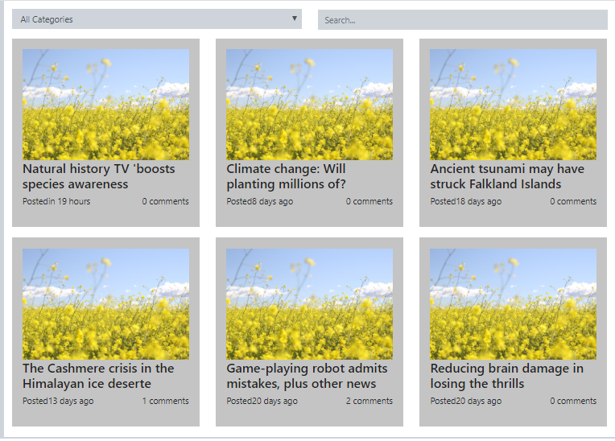
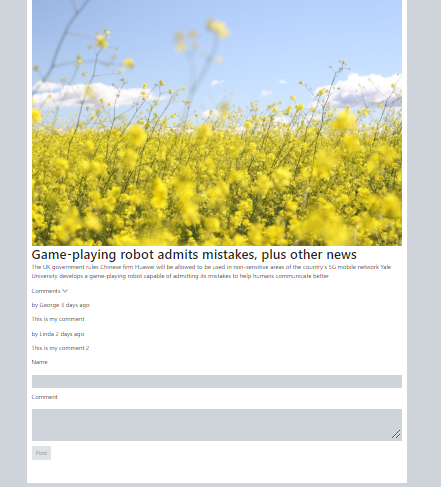

#React Blog App

<h2>The task</h2>

Develop a simple blog with the ability to search and filter posts, and view / add comments. Application must be a SPA and use multiple routes (defined below)

<h2>Tech stack</h2>
<ul>
<li>Started : create-react-app</li>
<li>Routing : React Router</li>
</ul>

<h2>Screens</h2>

<h2>Points done</h2>
<ol>
<li>React Router</li>
<li>Form Validation</li>
<li>JS functionalities</li>
<li>Index page - Keyword Search</li>
<li>Index page - Catalog Search</li>
<li>Viewpost page - comment added from Json</li>
<li>Comment form - saved & displayed on Front-end</li>
</ul>

